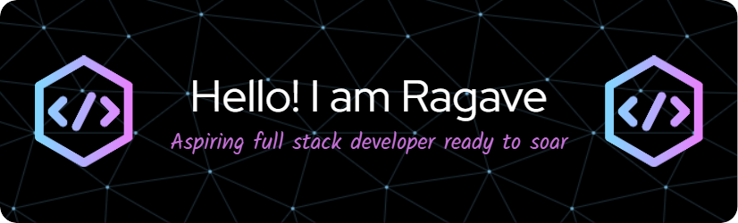

<h3 >Embark on my coding journey! From humble beginnings to innovative projects, witness my evolution in software development. Dive into diverse projects, offer feedback, or join in collaboration. Whether you're a fellow coder, potential employer, or just curious, find inspiration in my creations.</h3><h3> Let's push boundaries, solve problems, and shape the future of tech together, one line of code at a time! 🚀</h3>

  

<h3 align="left">Connect with me:</h3>

<h3 align="left">Languages and Tools:</h3>

               

